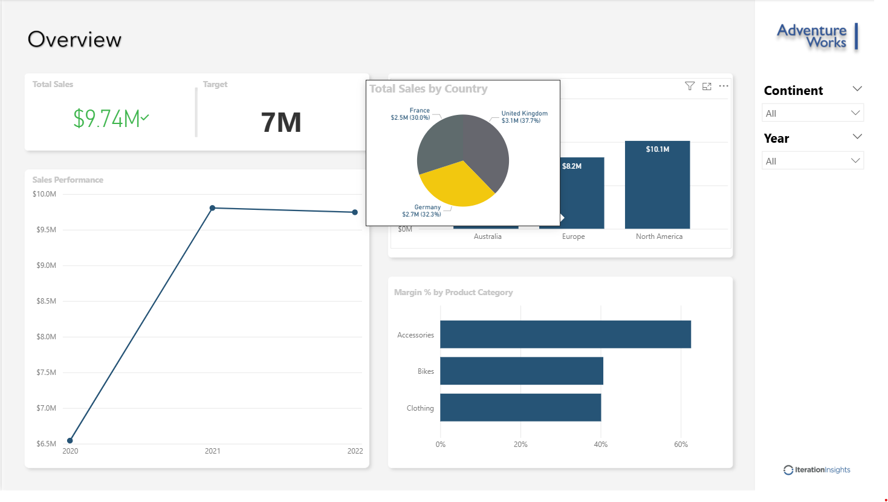

# 📊 Adventure Works Sales Dashboard

## 📌 Project Overview
This project is a Power BI dashboard built using the Adventure Works dataset.  
It provides insights into sales performance, and key business metrics to support data-driven decision-making.

---

## 🎯 Objectives
- Analyze sales trends over time  
- Identify top-performing products and categories  
- Track customer segmentation and behavior  
- Monitor KPIs such as revenue, profit, and order volume  

---

## 📂 Dataset
The dataset is based on the Adventure Works sample database and includes:
- Sales data  
- Product information  

---

## 🛠️ Tools & Technologies
- Power BI Desktop  
- DAX (Data Analysis Expressions)  
- Power Query (ETL transformations)  

---

## 📈 Key Features
- Interactive dashboards with filters and slicers  
- KPI cards for quick performance overview  
- Time-series analysis for revenue trends  
- Drill-down capabilities for detailed insights  
- Data model with relationships across multiple tables  

---

## 📊 Dashboard Preview

---

## 🧠 Data Modeling
- Star schema design  

**Fact Table:**
- Sales  

**Dimension Tables:**
- Customers  
- Products  
- Dates  
- Locations  

---

## ⚙️ How to Use
1. Download the `.pbix` file from this repository  
2. Open it using Power BI Desktop  
3. Refresh the data if needed  
4. Explore the dashboard using filters and visuals  

---

## 🚀 Insights
- Identified top revenue-generating regions  
- Discovered seasonal trends in sales  
- Highlighted high-value customer segments  

---

## 👤 Author
**Ozodbek Ozodov**

---

## 📎 File
- `Adventure_Works_Report.pbix`
